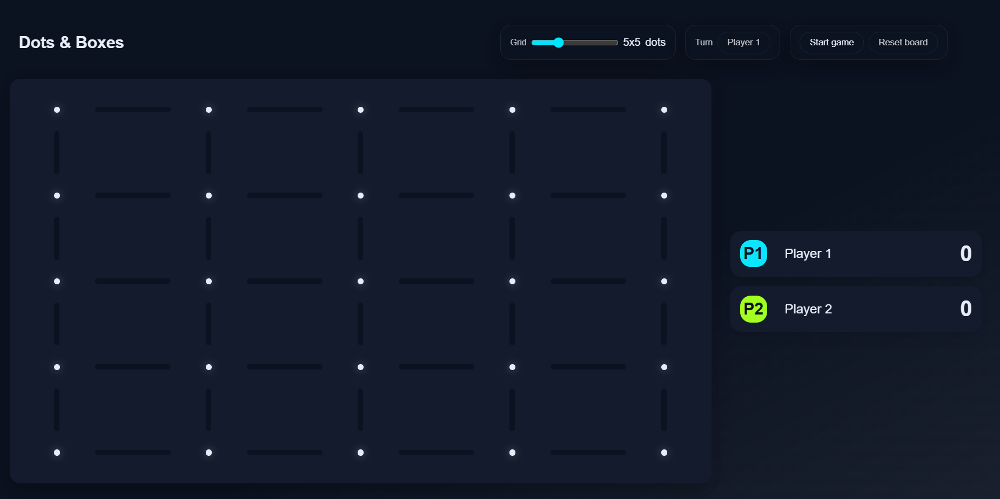

# Dots & Boxes

A classic pencil-and-paper strategy game for the browser. Claim edges, complete boxes, and outscore your opponent. Built with TypeScript and the DOM—no heavy frameworks.

## Play Online
- https://roosafeed.github.io/CoffeeBreakGames/dots-and-boxes/

## Features
- **Adjustable grid**: Choose a board size from 3×3 to 10×10
- **Two local players**: Editable names with turn highlighting
- **Click-to-claim edges**: Complete a box to earn a point and play again
- **Turn and score management**: Simple, readable state model
- **Responsive layout**: Works on desktop and mobile (questionably!)
- **Lightweight stack**: TypeScript + DOM, no framework or bundler at runtime

## Screenshots



## Controls
- **Start game**: Click "Start game"
- **Reset board**: Click "Reset board"
- **Choose grid size**: Use the "Grid" range slider (disabled while running)
- **Claim an edge**: Click between two dots to mark the line

## Tech Stack
- **TypeScript** (compiled to ES modules)
- **DOM rendering** (no Canvas or SVG required)
- **Vanilla JS modules** (no bundler at runtime)
- **Simple Pub/Sub** for UI and state updates

## Project Structure
```
dots-and-boxes/
├─ index.html            # Game page (loads dist/main.js)
├─ styles/
│  └─ main.css           # Neon theme + responsive layout
├─ src/
│  ├─ main.ts            # Game state wiring and startup
│  ├─ models/            # Dot, Edge, Player, GameState
│  ├─ services/          # PubSub, board/box utils
│  └─ ui/                # Board rendering, inputs, player UI
├─ dist/                 # Compiled JS output (generated by tsc)
├─ package.json
└─ tsconfig.json
```

## Getting Started
### Prerequisites
- Node.js 18+ (for the TypeScript compiler)
- A static HTTP server (recommended):
  - VS Code Live Server extension, or
  - `npx http-server` / `npx serve`

### Install & Build
```bash
# From repository root or this folder
cd dots-and-boxes
npm install
npm run build   # outputs to ./dist
```

### Run Locally
Because ES modules often don’t load via file://, serve over HTTP.
```bash
# Option 1: Using http-server
npx http-server . -c-1 -p 5173
# then open the URL printed by the server (e.g., http://127.0.0.1:5173)

# Option 2: VS Code Live Server
# Right-click index.html and choose "Open with Live Server"
```

### Develop (Watch Mode)
```bash
npm run watch  # recompile TS on save
# Keep your HTTP server running for auto-reload
```

## How It Works
- **Board model**: A grid of `Dot` nodes connected by `Edge`s; edges know who marked them.
- **Rendering**: The board is painted with DOM elements. Edges are buttons; when clicked, they call `markEdgeByCurrentPlayer` and update styling.
- **Box detection**: `checkIfBoxIsComplete(edge)` inspects neighbors around the claimed edge and returns how many boxes closed.
- **Turns & scoring**: Completing a box increments the current player’s score and grants another move; otherwise, the turn passes with `nextPlayer()`.
- **State & UI**: `GameState` publishes updates (`size`, `state`, `player`) via a simple Pub/Sub; UI handlers react to disable inputs, redraw the board, etc.

## Notes
- I used a graph-based approach (Dots and Edges) to model the board. It’s probably overkill for a simple game like this, but I felt like doing it—and that’s what this repo is about.
- The `tsconfig.json` uses `"moduleResolution": "bundler"`. Imports include `.js` extensions so browsers can load compiled modules from `dist/`.
- Use an HTTP server (not `file://`) to avoid ES module import errors.
- Grid size can only be changed while stopped; click Reset to rebuild the board.
- UI highlights the current player’s color via a CSS variable for subtle background tint.

## Roadmap / Ideas
- Fill completed boxes with the player’s color/initials
- End-of-game detection (when all edges are claimed)
- Undo last move
- Sounds
- Better UI cues
- Fix responsive layout on small screens
- Fix non functional UI elements (like the turn indicator)

## Author
Roosafeed Koya

## License
ISC