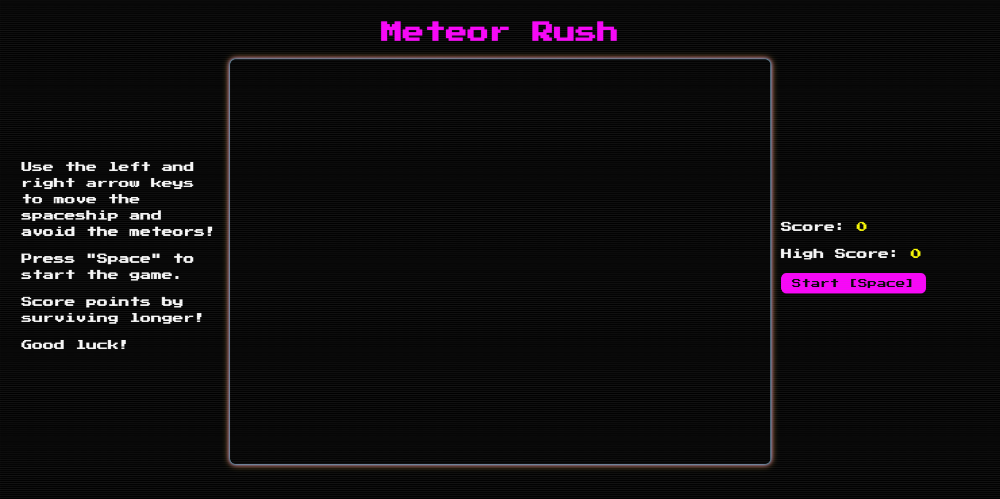
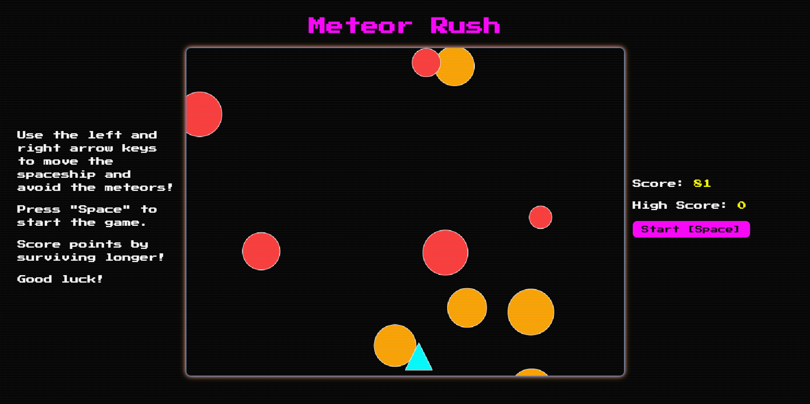

# Meteor Rush

A simple, retro-styled browser game where you pilot a rocket and dodge falling meteors. Built with TypeScript and the HTML5 Canvas API—no heavy frameworks required.

## Features
- **Fast arcade gameplay**: Move left/right and survive as long as you can
- **Progressive difficulty**: Asteroid speed and count scale with your level
- **Score and high score**: Dynamic UI updates with Pub/Sub pattern
- **Keyboard and buttons**: Play with Space/Arrow keys or on-screen controls

## Controls
- **Start / Resume**: Space or click "Start" / "Resume"
- **Pause**: Space or click "Pause"
- **Move**: Left/Right Arrow keys
- **Stop/Restart**: Buttons on the right panel

## Screenshots



## Tech Stack
- **TypeScript** (compiled to ES modules)
- **Canvas API** for rendering
- **Vanilla JS modules** (no bundler at runtime)
- **Simple Pub/Sub** for UI and state updates

## Project Structure
```
meteor-rush/
├─ index.html            # Game page (loads dist/main.js)
├─ styles/
│  └─ main.css           # CRT scanline effect + retro theme
├─ src/
│  ├─ main.ts            # Game loop, input handling, spawns, collisions
│  ├─ models/            # Rocket, Asteroid, Drawable, GameState
│  ├─ services/          # PubSub
│  └─ ui/                # UI bindings (buttons, score/high score)
├─ dist/                 # Compiled JS output (generated by tsc)
├─ package.json
└─ tsconfig.json
```

## Getting Started
### Prerequisites
- Node.js 18+ (for TypeScript compiler)
- A static HTTP server (recommended):
  - VS Code Live Server extension, or
  - `npx http-server` / `npx serve`

### Install & Build
```bash
# From repository root or this folder
cd meteor-rush
npm install
npm run build   # outputs to ./dist
```

### Run Locally
Because ES modules often don’t load via file://, serve over HTTP.
```bash
# Option 1: Using http-server
npx http-server . -c-1 -p 5173
# then open the URL printed by the server (e.g., http://127.0.0.1:5173)

# Option 2: VS Code Live Server
# Right-click index.html and choose "Open with Live Server"
```

### Develop (Watch Mode)
```bash
npm run watch  # recompile TS on save
# Keep your HTTP server running for auto-reload
```

## How It Works
- **Game loop**: `requestAnimationFrame` updates score, spawns asteroids, and renders entities
- **Difficulty**: Level increases with score; asteroid speed and count scale with level
- **Collisions**: Circle–triangle proximity check (rocket triangle vs. asteroid circle)
- **State & UI**: `GameState` publishes updates (state/score/highScore) consumed by UI handlers

## Notes
- The `tsconfig.json` uses `"moduleResolution": "bundler"`. Imports include `.js` extensions to work in browsers after TypeScript compiles to `dist/`.
- Buttons mirror keyboard actions; Space toggles start/pause/resume depending on state.

## Roadmap / Ideas
- Visual feedback for paused/running states in UI (`ui-state.ts` placeholders)
- Sound effects and animations
- Persistent high scores across sessions
- Global leaderboard

I might not even spend time on these features if I ever get around to it. Feel free to contribute!

## Author
Roosafeed Koya

## License
ISC